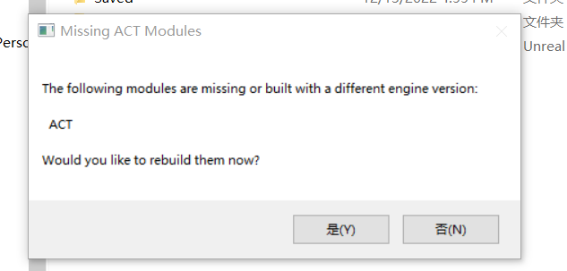

# How to use this project on your computer
1. This project use cable component, which may lead some loading problems. To avoid this, please edit **CableComponent.uplugin** in the **\<your UE engine folder\>/Engine/Plugins/Runtime/CableComponent**. Simply change the “LoadingPhase” variable to read “PreDefault” instead of “Default”. 
2. This project needs to be compiled by the UE engine when you open it at the first time. Thus, the engine will tell you the module are missing like the follow. Please choose yes and the engine will build the project. Then you can run the project successfully .
3. proposal: https://docs.google.com/document/d/1UsmYGX5EXiAEausiUmGv74FW5SaaAaSGExytPyth0Rc/edit
4. Control
   1. WASD: walk
   2. Ctrl+WASD: run
   3. F: use item to heal yourself
   4. C: bullet time
   5. Melee attack
      1. Q: normal attack
      2. Q+E: attack 2
      3. Q+E+Q: attack 3
      4. Q+E+Q+E: attack 4
   6. right button: change weapon
   7. ranged attack: hold **left button** to aim at enemy; release **left botton** to shoot
   8. Space: Grapple